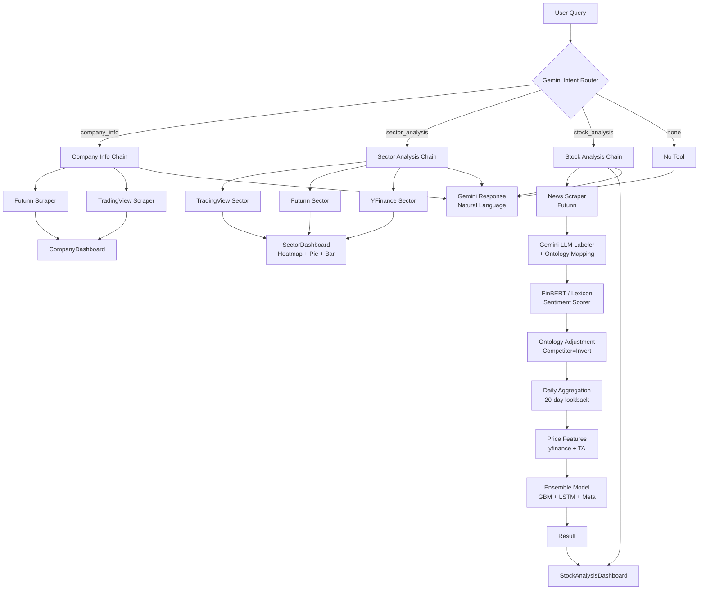

# FinChat

A financial chatbot application with a Next.js frontend and FastAPI backend, powered by Gemini for intent routing and response generation, with a full ML pipeline for stock prediction.

## Project Structure

```
finbot/
├── backend/                      FastAPI API server
│   ├── main.py                  FastAPI app, SSE streaming, CORS, routes
│   ├── chat_service.py          3-stage pipeline: routing → tools → response
│   ├── dashboard_gen.py          Payload builders for each dashboard type
│   ├── models.py                Pydantic request/response schemas
│   ├── prompts.yaml             All LLM prompts (routing, response templates)
│   ├── logging_config.py         Structured logging setup
│   ├── requirements.txt         Python dependencies
│   ├── .env                     Environment variables (API keys)
│   └── tools/                   Scrapers, ML models, and utilities
│       ├── manager.py           Scraper router with fallback chains
│       ├── stock_analysis.py     Full ML prediction pipeline
│       ├── ensemble_models.py    GBM + LSTM + meta stacking model
│       ├── price_feature_engine.py   TA feature extraction
│       ├── futunn_*.py          Futunn scrapers (company, sectors, news)
│       ├── tradingview_*.py      TradingView scrapers (company, sectors, news)
│       ├── yfinance_*.py         YFinance scrapers (sectors, price)
│       └── models/              Serialised model files (.pkl, .keras)
├── frontend/                    Next.js 16 web UI
│   ├── src/
│   │   ├── app/                App router, layout, page
│   │   ├── components/
│   │   │   ├── ChatInterface.tsx    Main chat UI + SSE handling
│   │   │   ├── ChatMessageItem.tsx  Message bubbles
│   │   │   ├── PromptInput.tsx      Text + image input
│   │   │   ├── ThinkingProcess.tsx  Real-time thinking steps
│   │   │   ├── CompanyDashboard.tsx  Company info dashboard
│   │   │   ├── SectorDashboard.tsx   Sector heatmap + pie chart
│   │   │   └── StockAnalysisDashboard.tsx  Full ML analysis dashboard
│   │   ├── lib/
│   │   │   ├── api.ts          Frontend API client
│   │   │   └── logger.ts       Client-side error logger
│   │   └── types/chat.ts      TypeScript types matching backend schemas
│   └── package.json
├── FinBotStreamlit/             Legacy Streamlit prototype (archived)
└── README.md
```

## Architecture

FinChat uses a 3-stage pipeline to process every user query:



**Stage 1 — Intent Routing:** Gemini classifies the user's query into one of four modes: `company_info`, `sector_analysis`, `stock_analysis`, or `none`. The routing prompt is defined in `backend/prompts.yaml`.

**Stage 2 — Tool Execution:** Based on the routed mode, one of three chains runs:
- `company_info` — tries Futunn first, falls back to TradingView
- `sector_analysis` — tries TradingView, then Futunn, then YFinance
- `stock_analysis` — runs the full ML pipeline (news → LLM labeler → sentiment → ontology → daily agg → price features → ensemble model)

**Stage 3 — Response Generation:** Gemini generates a concise natural-language response using the tool data as context, then the dashboard payload is sent alongside the reply to the frontend.

**Frontend dashboards** are rendered inline within the chat as interactive panels:
- `CompanyDashboard` — key stats, price, market cap, PE ratio, company profile
- `SectorDashboard` — colour-coded heatmap, click-to-flip bar charts, market-cap pie chart
- `StockAnalysisDashboard` — candlestick chart, news feed, sentiment timeline, BUY/SELL signal, probability score

## Prerequisites

- Python 3.10+
- Node.js 18+
- A Gemini API key from [Google AI Studio](https://aistudio.google.com/apikey)

## Setup

### Backend

```bash
cd backend
python -m venv venv
source venv/bin/activate      # Windows: venv\Scripts\activate
pip install -r requirements.txt
```

Create `backend/.env` with your API key:

```
GEMINI_API_KEY=your_gemini_api_key_here
```

Start the server:

```bash
uvicorn main:app --reload --port 8000
```

The API will be available at `http://localhost:8000`. Swagger docs are at `http://localhost:8000/docs`.

### Frontend

```bash
cd frontend
npm install
npm run dev
```

Open `http://localhost:3000` in your browser.

## Environment Variables

| Variable | Default | Description |
|---|---|---|
| `GEMINI_API_KEY` | *(required)* | Gemini API key for routing, LLM labeling, and response generation |
| `OLLAMA_VISION_MODEL` | `llava` | Ollama model for image inputs (legacy / optional) |

## Chat Modes

| Mode | Trigger | Dashboard |
|---|---|---|
| `company_info` | Ask about a specific company's profile, financials, or price | Company dashboard with stats and profile |
| `sector_analysis` | Ask about sectors, market heatmaps, sector performance | Sector heatmap with interactive charts |
| `stock_analysis` | Ask whether to buy/sell a stock, request a prediction | Full analysis: news, sentiment, BUY/SELL signal |
| `none` | General conversation, greetings | None |

## Deployment

### Backend

```bash
# Production
cd backend
pip install -r requirements.txt
uvicorn main:app --host 0.0.0.0 --port 8000
```

### Frontend

```bash
cd frontend
npm install
npm run build
npm start
```

For a full deployment guide, API reference, prompts, and architecture details, see [APPENDIX.md](./APPENDIX.md).

## Tech Stack

**Frontend:** Next.js 16, React 19, TypeScript, Tailwind CSS v4, recharts, lightweight-charts, Lucide icons

**Backend:** FastAPI, Uvicorn, Pydantic, requests, BeautifulSoup, Playwright, yfinance, TensorFlow, scikit-learn, joblib, Google Generative AI SDK, Python-dotenv

**ML:** GBM (LightGBM-style), LSTM (Keras), Meta Stacking, FinBERT (transformers), TextBlob lexicon fallback, entity ontology graph

**Scraping:** Futunn, TradingView, YFinance — each with exchange-aware routing and fallback chains
